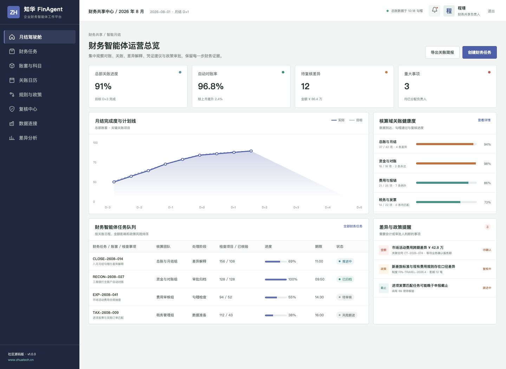
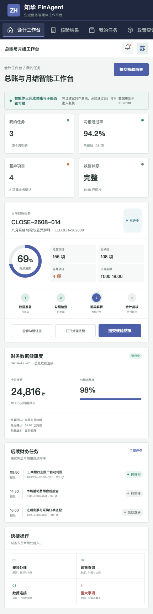

# 知华 FinAgent｜企业财务智能体工作平台

**社区源码版 / Java + Vue + MySQL / 管理端 + 财务人员 H5 工作台**

[知华科技官网](https://www.zhuatech.cn/)　·　[系统架构](docs/architecture.md)　·　[数据模型](docs/database.md)　·　[API](docs/api.md)



## 为什么做 FinAgent

月结、对账和政策核验包含大量重复检查，却又不能越过会计判断与内部控制。ZhuaTech FinAgent 将数据勾稽、差异解释、凭证建议和复核证据组织成任务流：智能体负责准备，会计负责判断，审批人负责授权。

| 工作域 | 社区版能力 | 控制边界 |
| --- | --- | --- |
| 对账 | 总账/子账勾稽、未达项分类 | 不自动核销 |
| 月结 | 日历、依赖、完整性检查、差异解释 | 不自动关账 |
| 凭证 | 生成凭证建议及政策依据 | 仅草稿，不自动记账 |
| 费用 | 政策匹配、例外抽查 | 大额与例外人工复核 |
| 资金 | 回单核对、权限检查 | 不发起支付 |



交易内控评估支持异常评分、大额交易、跨境属性、附件完整性和人工越权请求的组合判断。系统返回 `PASS`、`REVIEW` 或 `BLOCK`，并列出必须执行的控制措施；任何付款和记账动作仍需经过企业现有审批链。

## 本地体验

前端采用 Vue 3、Pinia、Vue Router、Axios、Vite；后端采用 Java 21、Spring Boot、Spring Security、JWT、JPA、Flyway；数据库为 MySQL 8，Java 工程包为 `cn.zhuatech.finagent`。

```bash
cd frontend && npm install && npm run dev:demo
```

访问 `http://localhost:5173`。管理端账号：`planner / Demo@2026`；会计端账号：`operator / Demo@2026`。默认 `AgentRuntime` 是本地演示实现，不包含真实财务数据、模型密钥或外部系统调用。

## 授权声明

本工程仅允许个人学习、研究及非商业技术交流，**不得用于商业用途**。包括企业内部生产使用、SaaS、项目实施交付、付费培训、商业分发或品牌替换在内的商业行为，必须先取得上海如静知华信息科技有限公司书面授权，详见 [LICENSE](LICENSE)。

如需财务智能体深度开发、模型接入、私有化部署与商业授权，请访问[知华科技（上海如静知华信息科技有限公司）官网](https://www.zhuatech.cn/)或扫码沟通：

| 微信一 | 微信二 |
| --- | --- |
|  |  |

SEO 关键词：财务智能体、Finance Agent、智能月结、自动对账、差异分析、财务共享中心源码、Java Vue 财务系统、知华科技。

## 财务关账准备度

新增 `POST /api/finagent/insights/close-readiness`，汇总主体关账、对账、重大调整和待审批任务，输出 `READY`、`REMEDIATE` 或 `BLOCK_CLOSE`。

## 企业级智能凭证建议发布

新增 `POST /api/enterprise/finagent/journal-proposal-release`，覆盖凭证、期间、借贷、科目主体、职责、税务、重复、审计和冲销，返回 `POST / REVIEW / BLOCKED`。详见 [凭证发布说明](docs/ENTERPRISE_JOURNAL_RELEASE.md)。
